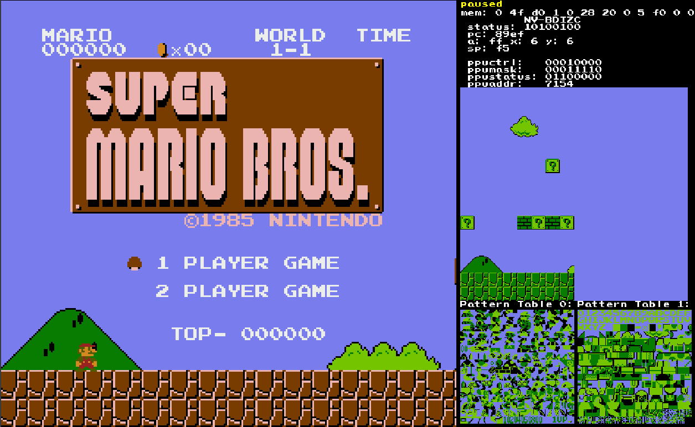
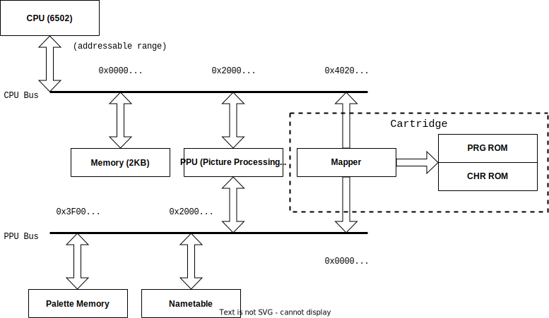

# NES Emulator

A Nintendo Entertainment System emulator written in C++. This has only been tested on Linux but should be cross-platform.

---

## Features:

- [x] 6502 CPU
- [x] iNES cartridge loading
- [x] background rendering
- [x] sprite rendering
- [x] user input
- [ ] audio
- [ ] more mappers

Currently implemented mappers: 
- NROM (000)
- UxROM (002)
  
---

## Controls

- A button: X
- B button: Z
- Start: S
- Select: A
- D-pad: Arrow keys
- Play/pause: Space
- Step single CPU instruction (while paused): Enter
- Cycle displayed nametable: Tab
- Cycle colour palette: P

---

## Screenshot

The main screen is drawn to the left, with debug information drawn to the right. This includes the values of internal registers, the selected nametable (changed by pressing tab), and the pattern tables.

---

## Structure

The structure of the code closely resembles the structure of the hardware itself, with busses being used to map addresses to the correct components. The functionality of the PPU bus is encapsulated within the PPU class, whereas the CPU bus is its own class which can be though of as the main class of the emulator.

This structure is shown by the following diagram:

---

## Acknowledgements
- [Nesdev Wiki](https://www.nesdev.org/wiki/Nesdev_Wiki) - Hardware reference
- [olcPixelGameEngine](https://github.com/OneLoneCoder/olcPixelGameEngine) - Library used to draw window
- [javidx9 youtube channel](https://www.youtube.com/c/javidx9) - Great video series on NES emulation
